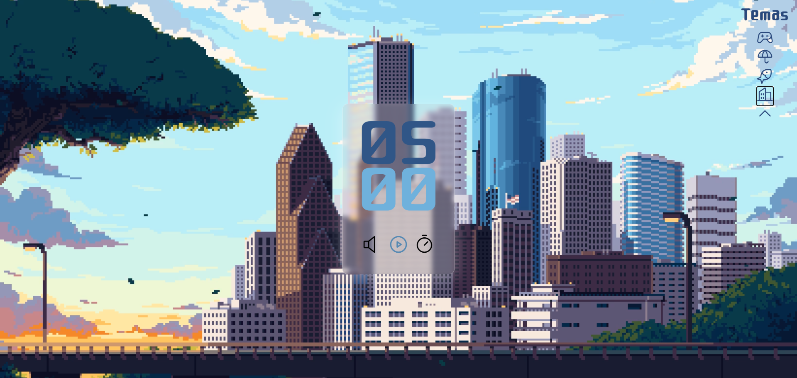

<h1 align="center"> FocusTimerV2 </h1>

Site desenvolvido por <a href="https://www.linkedin.com/in/almeida08/">Lucas Almeida</a> 

https://github.com/almeida0808/FocusTimerV2/assets/144072612/f8c26248-7d5a-4809-a8ff-940942e90f7c

  <a href="#-tecnologias">Tecnologias</a>&nbsp;&nbsp;&nbsp;|&nbsp;&nbsp;&nbsp;
  <a href="#-projeto">Projeto</a>&nbsp;&nbsp;&nbsp;|&nbsp;&nbsp;&nbsp;
  <a href="#-layout">Designer</a>

  

 

  

## 🚀 Tecnologias

Esse projeto foi desenvolvido com as seguintes tecnologias:

- CSS | Estilização da aplicação
- JavaScript | Controla as funções do programa
- Git e Github | Controle de Versão do código

## 💻 Projeto
O FocusTimerV2 é um projeto desenvolvido com base na Tecnica Pomodoro que consiste em:
25 minutos de concentração, seguidos de 5 minutos de descanso: essa é a base do método Pomodoro de estudo. Com isso, é possível driblar distrações e ter mais foco para estudar, de forma simples e prática. Ou seja, basta dividir as tarefas em intervalos curtos, enquanto faz pausas frequentes para respirar e relaxar.

Com base nisso usamos a programação pra criar um projeto totalmente funcional usando JavaScript , possibilitando criar um cronometro com o tempo totalmente personalizado de acordo com a preferencia do usuário e também podendo escolher o tema da aplicação de acordo com o seu gosto!

## 🔖 Layout
Inicialmente pensei em deixar a aplicação o mais personalizavel possivel, para agradar todos os tipos de usuários podendo contar até com som ambiente personalizado de acordo com o tema!

## 🔖 Deploy
[Acesse o projeto](https://almeida0808.github.io/FocusTimerV2)

Feito por Lucas Almeida  - [Veja mais projetos no meu Linkedin](https://www.linkedin.com/in/almeida08/)

